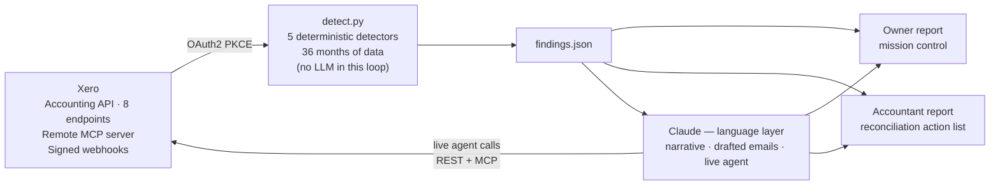
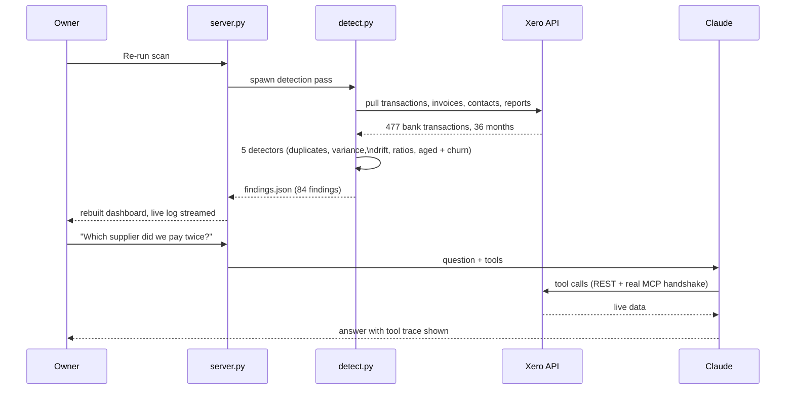

# The Pass — v0.1 prototype

**A line check for a hospitality operator's Xero books.**

Your data holds the answers. No one is watching it. Now something is.

The Pass runs deterministic anomaly detection over the full history of a Xero organisation —
every account, every ratio, three years deep — then uses Claude to explain what it found in
plain English, draft the chase and win-back emails, and answer free-form questions against
live Xero data.

**Guardrails were the first design decision.** AI is strong, and with historic books that is
exactly the problem — the last thing an operator needs is a hallucinated finding: nuked books,
or a manager accused over something that never happened. So nothing in the detection is a
model's opinion. Every finding deep-links through Xero's short-code redirect straight into the
live record — your accountant clicks the line, lands on the reconciliation, and decides. The AI
explains and drafts; the ledger stays the source of truth.

Built in 24 hours for the **Xero App & Agent Hackathon** (Encode Club, London, 4–5 July 2026).
Entered for **Bounty 01: Productivity Powerhouse** and **Bounty 03: Cash Flow Accelerator**.

## Links

| | |
|---|---|
| Live report (owner dashboard) | https://open-sandal-rkdw.here.now |
| Pitch deck | https://hidden-rocket-atda.here.now |
| Working demo video (79s, unedited) | https://jovial-kettle-6j4b.here.now |

## What it caught

Real findings from a real Xero organisation seeded with 36 months of realistic trading history:

- **Zurich Insurance paid twice** — £1,800 on 10 March, again on the 13th
- **Wages hit 33% of sales** (usual: 26%) — the raw pound amounts looked fine
- **Bank fees crept £127 → £291** over six months — no single month rang an alarm
- **Borough Films**: six bookings near £3,000 each, then 418 days of silence — win-back drafted

84 findings · 36 months · one small tavern.

## Architecture

Deterministic where money demands accuracy. AI where language beats arithmetic.
There is no LLM in the detection loop — it cannot hallucinate a finding.



### A scan, end to end



## The five detectors

1. **Duplicate payment** — same payee, same amount, within 14 days
2. **Variance** — per-account monthly totals vs a 3-month trailing average
3. **Drift** — slow creep vs a 6-month-old baseline (catches what monthly snapshots miss)
4. **Cross-account ratio** — wages-to-sales, card-fees-to-sales, comps-to-sales, so a wage
   spike shows even when sales moved too
5. **Aged payables / receivables + churn** — money owed both ways, plus a high-value repeat
   customer who has gone quiet

Claude then drafts the chase email for overdue customers and the win-back message for lapsed
ones, and powers a live agent that answers free-form questions by calling the Xero REST API
and Xero's actual **Remote MCP server** (full `initialize → initialized → tools/call`
handshake against `builders.xero.com`).

## Xero API surface

- **Accounting API**: `Organisation`, `Accounts`, `Contacts`, `BankTransactions`, `Invoices`,
  `Reports/ProfitAndLoss`, `Reports/AgedPayablesByContact`, `Reports/AgedReceivablesByContact`
- **Remote MCP Server**: `list_trial_balance`, `get_connected_tenants`, called live
- **Identity**: OAuth2 PKCE authorization-code flow, token refresh, RFC 7009 revocation
- **Webhooks**: HMAC-SHA256 signature verification per Xero's spec, tested against signed and
  tampered payloads (`verify_webhook.py`)

## Project layout

```
src/        the running system
  detect.py                 detection engine - pulls live Xero data, runs all
                            detectors, writes findings.json + timeseries.json
  build_report.py           renders the owner dashboard (report.html)
  build_accountant_report.py  renders the accountant report
  server.py                 Flask app: dashboard, live agent chat, live re-scan,
                            OAuth disconnect, signature-verified webhook receiver
  xero_tools.py             agent tool layer - REST tools + one routed through
                            the real MCP server
  xero_mcp_client.py        minimal client for Xero's MCP Streamable HTTP handshake

scripts/    one-time and operational scripts
  xero_auth.py              OAuth2 PKCE login (creates xero_tokens.json)
  refresh_token.py          token refresh (access tokens last 30 minutes)
  seed_data.py              seeds the demo org: 3 years of realistic history
  add_receivables.py        seeds overdue invoices
  add_churned_customer.py   seeds the lapsed high-value customer
  verify_webhook.py         proves webhook signature verification (signed +
                            tampered payloads against the running server)

docs/       the pitch deck PDF
video/      demo video tooling (record-demo.js: one continuous Playwright
            session against the live app - the video is not edited)
deck.html   the pitch deck (arrow keys to navigate)
run.sh      demo launcher - refreshes the token, refuses to start without keys
```

All commands run from the repo root.

## Running it

```bash
# one-time: authorise against your Xero app (creates xero_tokens.json)
python3 scripts/xero_auth.py

# one-time: seed the demo org
python3 scripts/seed_data.py
python3 scripts/add_receivables.py
python3 scripts/add_churned_customer.py

# the pipeline
python3 src/detect.py                    # pulls live data, writes findings
python3 src/build_report.py              # owner dashboard -> report.html
python3 src/build_accountant_report.py   # accountant report -> accountant_report.html

# the live demo server (agent chat + live re-scan)
ANTHROPIC_API_KEY=sk-... ./run.sh
# then open http://localhost:5050
```

`run.sh` refreshes the Xero token, sets the webhook signing key, and refuses to start without
an Anthropic key — so the live demo can't silently degrade. At report *build* time the drafted
messages fall back to solid templates without a key; the live chat genuinely requires one.

## Honest limits (v0.1)

- The webhook receiver is real and tested, but not registered against a live Xero webhook
  subscription — that needs a public HTTPS endpoint this prototype doesn't have.
- The published dashboard is a static snapshot: the agent chat and re-scan buttons need the
  local server. Deliberate — the agent has tool access that shouldn't face the open internet
  unauthenticated, and Xero rotates refresh tokens, so a second live instance would race the
  demo machine's session.
- The live agent connects to the demo organisation, not a visitor's own Xero.

## Where it grows

- **Webhooks** — catch it the day it happens, not at month end
- **Multi-org** — one owner, ten sites, one report
- **Payments data** — act on cash flow, not just see it
